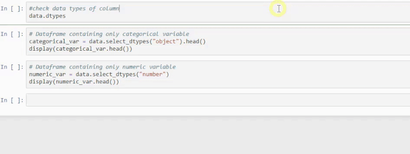
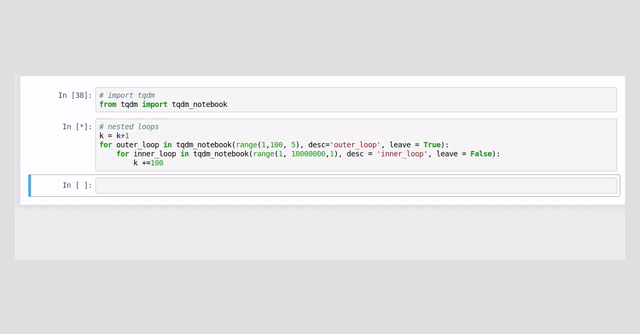
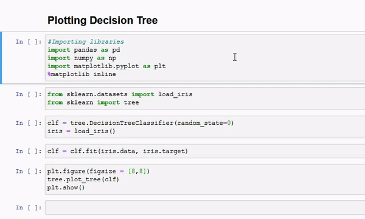

# EDA Hacks

## 1) QGrid on DataFrames
 

## 2) PandasQuick Analysis


## 3) TQDM: ProgressBar

```python
from tqdm import tqdm
for i in tqdm(range(0,int(10E6))):
    continue

OR

from tqdm.notebook import tqdm
progress_bar = trange(10)
for outer_loop in progress_bar:
    for inner_loop in range(10):
        sleep(0.5)
        progress_bar.set_description(f"Province: {outer_loop}; UPC: {inner_loop}")
```
## 4) Plotting Deceision Tree :

